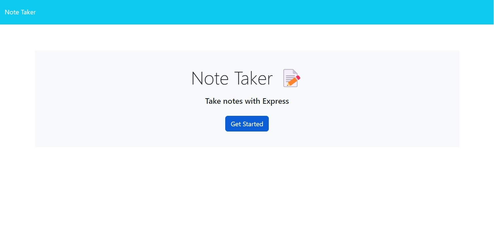
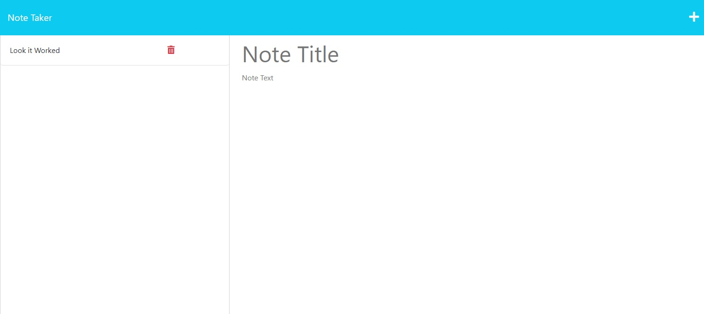
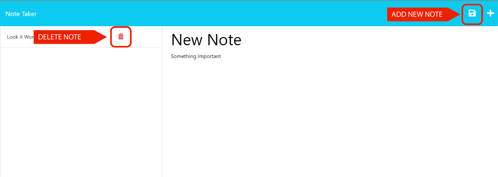
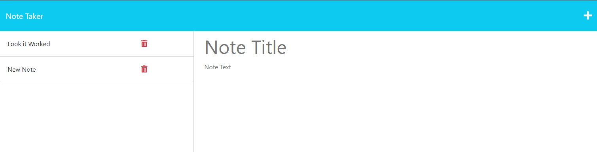

# Note-Taker
Application deployed with Node.js and Heroku. The application can acces, save and delete notes using a JSON file. 

Application that is used to write and save notes. Through Express.js back end and will save and retrieve note data from a JSON file. 

https://danotetaker-eda88a1c37c6.herokuapp.com/
or
https://danotetaker.onrender.com/

[](https://opensource.org/licenses/MIT) 


## Table of Contents

1. [Authors](#authors)

2. [Usage/Examples](#usageexamples)    
    
3. [Demo](#demo)    

4. [Contributing](#contributing)

5. [License](#license)

## Authors

[@Sergrojas29](https://www.github.com/Sergrojas29)


    
## Usage/Examples

Landing Page

Note Page


How to:



Note Added



    
## Demo


https://github.com/Sergrojas29/Note-Taker/assets/128770839/d134f93c-d4f6-4a4f-aa5a-64f11780973c


   

## Contributing
source code:
https://github.com/coding-boot-camp/miniature-eureka

    
## Questions
Contact me : 

Github: Sergrojas29

Email: Sergrojas29@gmail.com
    

## License

[MIT](https://choosealicense.com/licenses/mit/)


## User Story

```
AS A small business owner
I WANT to be able to write and save notes
SO THAT I can organize my thoughts and keep track of tasks I need to complete
```


## Acceptance Criteria

```
GIVEN a note-taking application
WHEN I open the Note Taker
THEN I am presented with a landing page with a link to a notes page
WHEN I click on the link to the notes page
THEN I am presented with a page with existing notes listed in the left-hand column, plus empty fields to enter a new note title and the note’s text in the right-hand column
WHEN I enter a new note title and the note’s text
THEN a Save icon appears in the navigation at the top of the page
WHEN I click on the Save icon
THEN the new note I have entered is saved and appears in the left-hand column with the other existing notes
WHEN I click on an existing note in the list in the left-hand column
THEN that note appears in the right-hand column
WHEN I click on the Write icon in the navigation at the top of the page
THEN I am presented with empty fields to enter a new note title and the note’s text in the right-hand column
```
